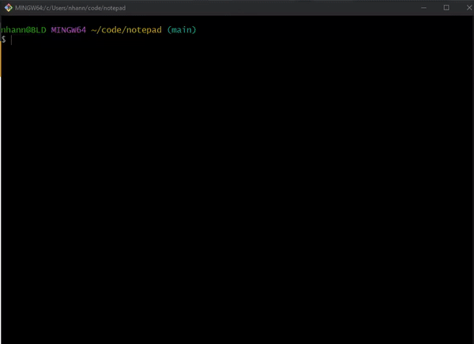
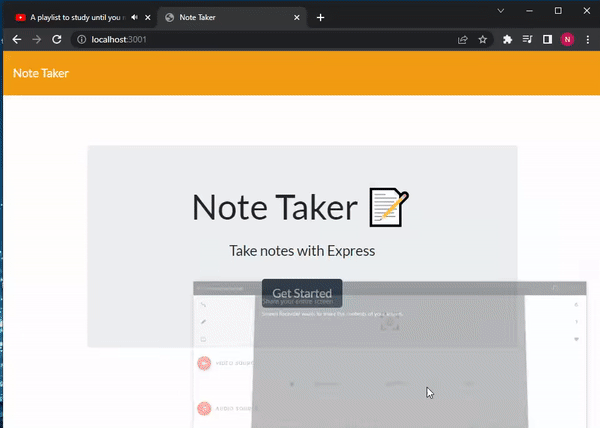

# Note Taker

## Installation

The application will be invoked by using the following command:

```bash
npm start
```
Use following port to view the application:

```bash
http://localhost:3001/
```


 


[HEROKU DEPLOYMENT LINK](https://expressnotepad.herokuapp.com/)

## The Process
To satisfy the criteria, we had to:
- Install inquirer package
- Install path package
- Install express package
- Refractor CSS file to give HTML nootbook theme
- Code server.js to initialize applications' backend

Specific functions of server.js:

Create new note along with new object and alert terminal
```javascript
app.post("/api/notes", (req, res) => {
    let savedNotes = JSON.parse(fs.readFileSync("./db/db.json", "utf8"));
    let newNote = req.body;
    let uniqueID = (savedNotes.length).toString();
    newNote.id = uniqueID;
    savedNotes.push(newNote);

    fs.writeFileSync("./db/db.json", JSON.stringify(savedNotes));
    console.log("A new note has been saved: ", newNote);
    res.json(savedNotes);
})
```

Delte note along with object and alert terminal
```javascript
app.delete("/api/notes/:id", (req, res) => {
    let savedNotes = JSON.parse(fs.readFileSync("./db/db.json", "utf8"));
    let noteID = req.params.id;
    let newID = 0;
    console.log(`Deleting note with ID ${noteID}`);
    savedNotes = savedNotes.filter(currentNote => {
        return currentNote.id != noteID;
    })
    
    for (currentNote of savedNotes) {
        currentNote.id = newID.toString();
        newID++;
    }

    fs.writeFileSync("./db/db.json", JSON.stringify(savedNotes));
    res.json(savedNotes);
})

```

## The Result
After dynamically coding our backend application using Express.js along with refractoring CSS and HTML, we were able to provide a fully functional fullstack application that allows our client to write, store, retrieve, and delete notes.

This project was uploaded to GitHub at the following repository link:
[https://github.com/nhanng19/notepad](https://github.com/nhanng19/notepad)

Deployed Web Application link: [https://expressnotepad.herokuapp.com/](https://expressnotepad.herokuapp.com/)
